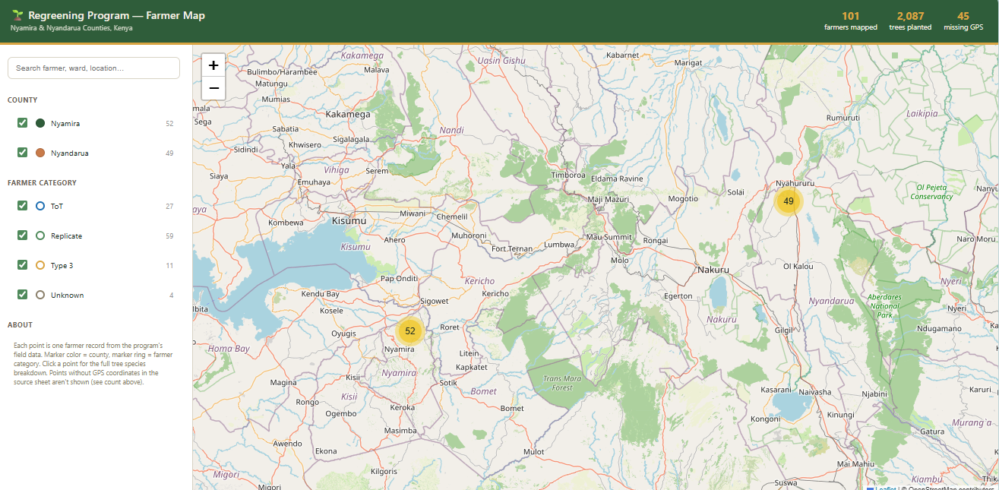
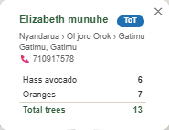

# 🌱 Regreening Farmers Map

An interactive GIS web application for visualizing farmer locations participating in the Regreening Program in Kenya.

## Features

- Interactive Leaflet map
- Marker clustering
- Search farmers
- County filters
- Farmer category filters
- Popup with tree species information
- Responsive interface
- Statistics dashboard
  
## Data

The application visualizes farmer records from:

- Nyamira County
- Nyandarua County

Each marker contains:

- Farmer name
- County
- Ward
- GPS Coordinates
- Category
- Tree species
- Total trees

## License

[MIT](https://github.com/Pantane1/regreening-farmers-map/blob/main/LICENSE)

## 👤 Author

**Wamuhu Martin** (Pantane1)

- Support: [pay-me](https://pantane.is-a.dev/support)

  <a href="#">

  <a href="#">

